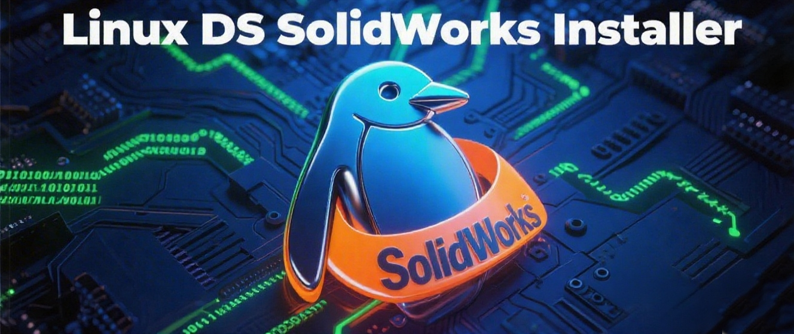
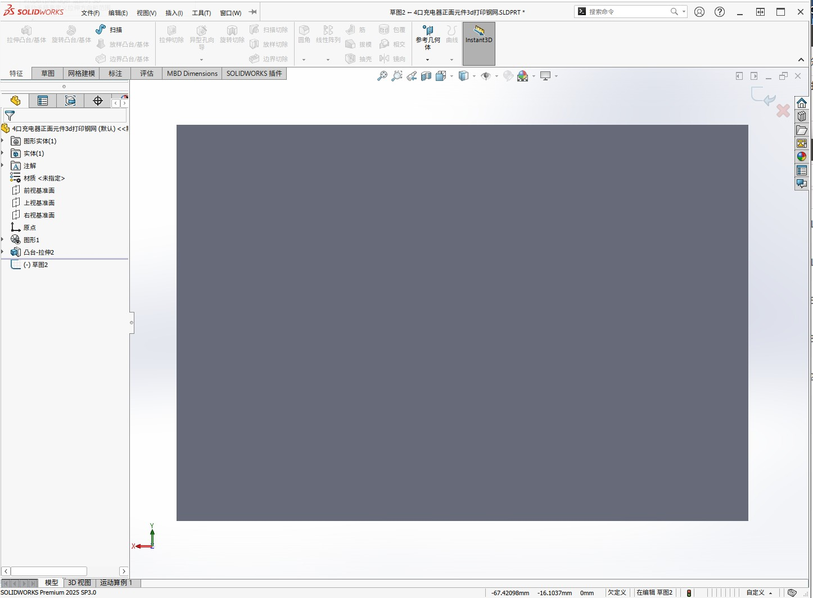
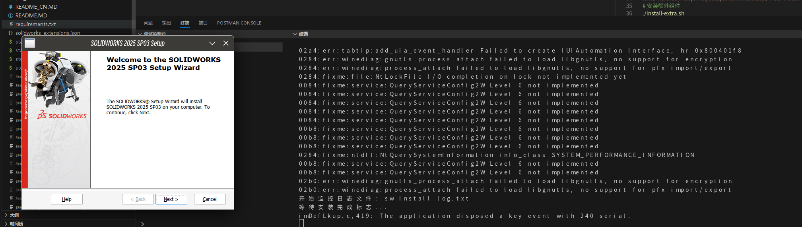
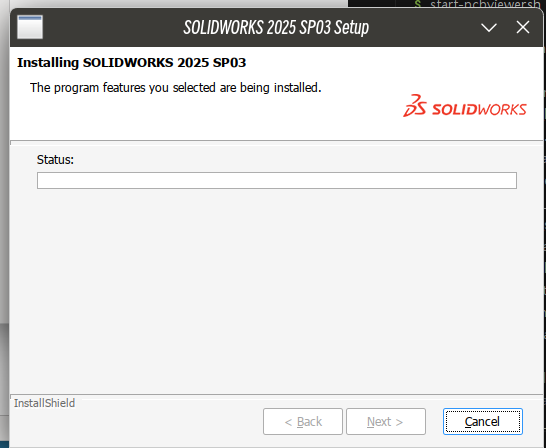
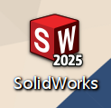
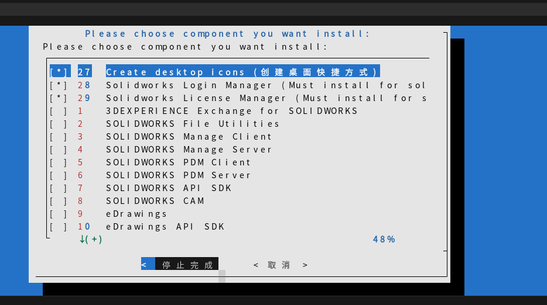
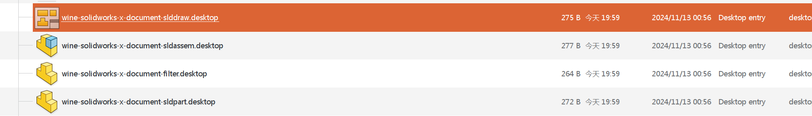

# Linux DS SolidWorks Installer
[](https://github.com/xe5700/Linux.DS.Solidworks.Installer/)
 [中文](https://github.com/xe5700/Linux.DS.Solidworks.Installer/README_CN.MD)|[English](https://github.com/xe5700/Linux.DS.Solidworks.Installer/README.MD) 
## Acknowledgments
Thanks to the project [SOLIDWORKS-for-Linux](https://github.com/cryinkfly/SOLIDWORKS-for-Linux). This project has referenced that project for production, and improved the installation steps to increase installation success rate and runtime success rate.

## Compatibility
The script has been tested on Arch Linux and is expected to be compatible with other distributions.

Recommended to install SolidWorks 2023/2025 versions:
- Version 2023 can run on GE-Proton 8-25 (requires Proton 9/Wine 9 or higher for installation; versions below 8 will get stuck during installation progress).
- Version 2025 cannot run on this version but can run normally and be installed on GE-Proton 10-10.

It is recommended to use Lutris or Proton-Qt to install the Proton environment, which is more convenient.

Please obtain the SolidWorks installation package yourself from the internet; we do not provide downloads.

## Software Package Installation

### Arch Linux
```bash
sudo pacman -Sy winetricks wine python3 python-pip
pip3 install -r requirements.txt  # Install environment
```
Or create a virtual environment:
```bash
python3 -m venv venv
source venv/bin/activate
pip3 install -r requirements.txt
```

### Ubuntu/Debian
To be added

## Installation Steps
1. First, obtain a legitimate or special SolidWorks installation image from any channel (SolidWorks 2023/2025 version is recommended).
2. Ensure that you have installed Proton version 9.0 or higher, which can be done using Lutris or ProtonUp-Qt. Winetricks also needs to be installed.
3. Modify the environment.sh file, setting environment variables according to your Wine installation package and Proton setup, along with the SolidWorks image name.
4. Depending on your version, use install.sh or install_ds.sh for installation (use install_ds.sh for patched versions and install.sh for original versions).
5. After manually completing the SolidWorks installation, the process will end automatically. Select the additional components you need to install, including creating a shortcut.
6. After successful installation, you can start SolidWorks via start.sh or the SolidWorks icon on the desktop.


## Screenshots





